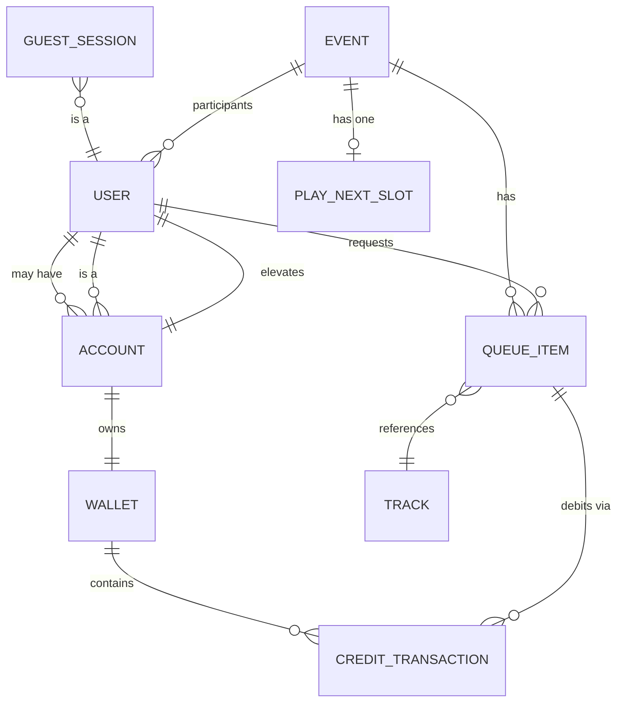
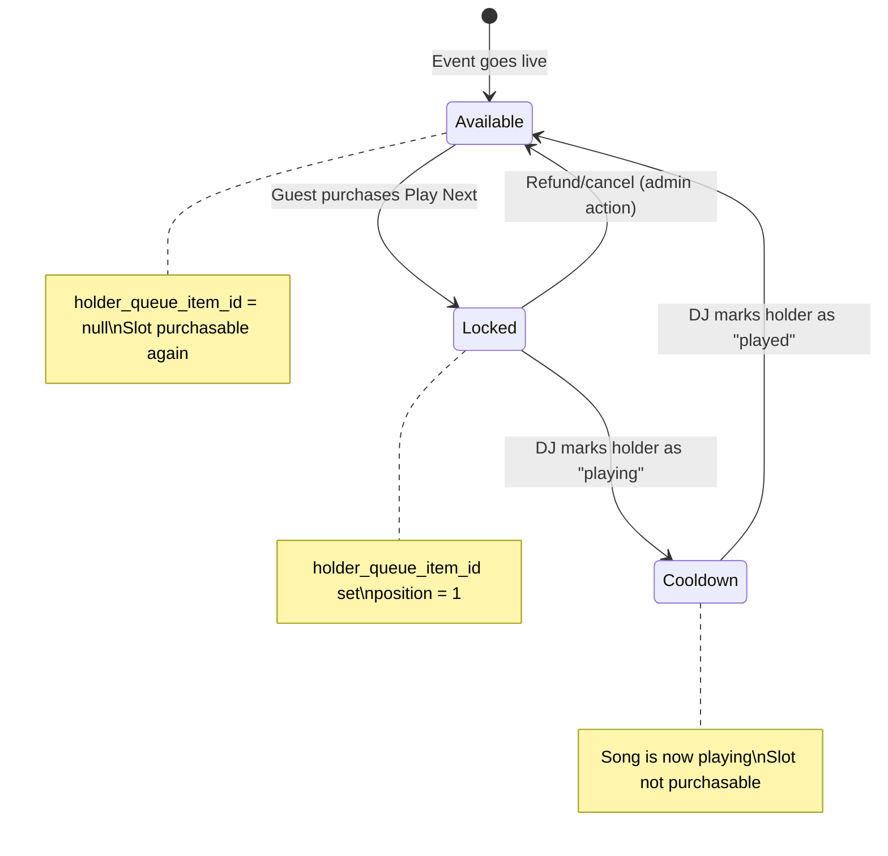

# mrdj — Architecture (v0 MVP)

> The contract artifact. This is the smallest coherent design that ships the MVP.
> Owned by **Rusty**; implements decisions D1–D5 from `.squad/decisions.md`.

---

## 1. Core Entities & Relationships

### 1.1 Entity-Relationship Diagram



### 1.2 Entity Definitions

#### **User** (abstract identity)
Every participant has a User identity — either a transient Guest session or a persistent Account.

| Field | Type | Notes |
|-------|------|-------|
| `id` | UUID | PK; **server-authoritative** |
| `type` | enum | `guest` \| `account` |
| `created_at` | timestamp | |

#### **GuestSession**
Lightweight, no-account identity. Tied to a browser session; sufficient for requests and credit spend within an event.

| Field | Type | Notes |
|-------|------|-------|
| `id` | UUID | PK (same as User.id for type=guest) |
| `event_id` | UUID | FK → Event; scoped to one event |
| `session_token_hash` | text | Hashed token for session validation |
| `expires_at` | timestamp | Auto-expire after event or inactivity |

#### **Account**
Persistent identity (Google SSO). Can hold credits across events.

| Field | Type | Notes |
|-------|------|-------|
| `id` | UUID | PK (same as User.id for type=account) |
| `provider` | text | `google` (extensible) |
| `provider_id` | text | External ID from SSO |
| `email` | text | Unique |
| `display_name` | text | |
| `role` | enum | `user` \| `admin`; **server-authoritative** |
| `created_at` | timestamp | |

#### **Event**
A DJ session; scopes the queue and Play Next slot.

| Field | Type | Notes |
|-------|------|-------|
| `id` | UUID | PK |
| `slug` | text | URL-friendly join code |
| `name` | text | Display name |
| `owner_id` | UUID | FK → Account (the DJ/admin) |
| `status` | enum | `draft` \| `live` \| `ended`; **server-authoritative** |
| `created_at` | timestamp | |
| `started_at` | timestamp | When the DJ went live |
| `ended_at` | timestamp | |

#### **Track** (normalized, provider-agnostic)
A song abstraction. Resolved from Apple Music or Spotify; stored/cached for display.

| Field | Type | Notes |
|-------|------|-------|
| `id` | UUID | PK; internal ID |
| `provider` | enum | `apple_music` \| `spotify` |
| `provider_id` | text | External ID from provider |
| `title` | text | |
| `artist` | text | |
| `album` | text | |
| `artwork_url` | text | |
| `duration_ms` | int | |
| `preview_url` | text | (optional) |
| `cached_at` | timestamp | For cache invalidation |

#### **QueueItem** (Request)
A song request in the queue. One per Event + Track + User combination (or allow duplicates by different users — policy choice, default: allow).

| Field | Type | Notes |
|-------|------|-------|
| `id` | UUID | PK |
| `event_id` | UUID | FK → Event |
| `track_id` | UUID | FK → Track |
| `requester_id` | UUID | FK → User |
| `position` | int | **Server-authoritative**; 1 = next to play |
| `status` | enum | `pending` \| `approved` \| `playing` \| `played` \| `rejected` |
| `is_play_next` | bool | True if this item holds the Play Next slot |
| `created_at` | timestamp | |
| `updated_at` | timestamp | |

#### **PlayNextSlot** (single-resource lock per Event)
The crux state machine. One row per Event; models the premium Play Next availability.

| Field | Type | Notes |
|-------|------|-------|
| `event_id` | UUID | PK; FK → Event |
| `status` | enum | `available` \| `locked` \| `cooldown`; **server-authoritative** |
| `holder_queue_item_id` | UUID | FK → QueueItem; null when available |
| `locked_at` | timestamp | When purchased |
| `reset_at` | timestamp | When the bumped song finished playing |

#### **Wallet**
Credit balance for an Account. Guests spend via ephemeral session credits OR must sign in.

| Field | Type | Notes |
|-------|------|-------|
| `account_id` | UUID | PK; FK → Account |
| `balance` | int | Current credit balance; **server-authoritative** |
| `updated_at` | timestamp | |

#### **CreditTransaction** (append-only ledger)
Every credit grant and spend. Immutable, auditable.

| Field | Type | Notes |
|-------|------|-------|
| `id` | UUID | PK |
| `account_id` | UUID | FK → Account |
| `type` | enum | `grant` \| `spend` \| `refund` |
| `amount` | int | Positive = credit, negative = debit |
| `reason` | text | `purchase`, `up_next`, `play_next`, `refund`, `promo` |
| `reference_id` | UUID | FK to QueueItem or external payment ID |
| `idempotency_key` | text | **Unique**; prevents duplicate processing |
| `created_at` | timestamp | Immutable |

---

## 2. The Play Next State Machine

Play Next is the premium, single-slot bump. The rules (from PRD §4.5):

1. Only **ONE** Play Next is purchasable at any time per Event.
2. It is **not always available**.
3. After the Play-Next'd song **has played**, the slot **resets** to available.

### 2.1 State Diagram



### 2.2 States

| State | Purchasable? | Description |
|-------|--------------|-------------|
| `available` | ✅ Yes | No current holder; guests can buy |
| `locked` | ❌ No | A guest owns the slot; their song is position 1 |
| `cooldown` | ❌ No | The Play-Next song is currently playing |

### 2.3 Transitions & Guards

| From | To | Trigger | Guard / Invariant |
|------|-----|---------|-------------------|
| `available` | `locked` | `purchase_play_next(queue_item_id, idempotency_key)` | Slot status == `available`; sufficient credits; atomic credit debit + slot lock |
| `locked` | `cooldown` | `mark_now_playing(queue_item_id)` | DJ action; queue_item_id == holder_queue_item_id |
| `cooldown` | `available` | `mark_played(queue_item_id)` | DJ action; queue_item_id == holder_queue_item_id; clears holder |
| `locked` | `available` | `cancel_play_next(queue_item_id)` | Admin/DJ action; refunds credits |

### 2.4 Concurrency Hazard & Lock

**Problem:** Two guests race to purchase the same Play Next slot simultaneously.

**Solution:** The slot is a **single-resource lock** implemented via:

1. **Database row-level lock**: `SELECT … FOR UPDATE` on the `PlayNextSlot` row.
2. **Atomic transaction**: Check status == `available`, debit credits, set status = `locked`, set `holder_queue_item_id` — all in one transaction.
3. **Idempotency key**: Unique per purchase attempt; retries are safe.

If two requests arrive concurrently:
- First to acquire the row lock wins, completes the transaction.
- Second sees status != `available` → returns "slot unavailable", no credit debit.

**Invariant:** At most one `QueueItem.is_play_next = true` per Event at any time.

### 2.5 Reset Path

The reset happens **only when the DJ marks the Play-Next song as "played"** (transition from `cooldown` → `available`). This is the authoritative trigger — not a timer, not the guest.

---

## 3. Up Next vs Play Next

Both are paid queue bumps. The difference:

| Aspect | Up Next | Play Next |
|--------|---------|-----------|
| **Effect** | Moves a request toward the front (e.g., +5 positions) | Moves a request to **position 1** (next to play) |
| **Availability** | Always available (any queued item) | **Single slot**; only when status == `available` |
| **Cost** | Lower | Higher (premium) |
| **Concurrency** | Multiple guests can bump different items simultaneously | Only one guest can hold the slot at a time |
| **Reset** | N/A | Resets after the bumped song has played |

### 3.1 Up Next Implementation

1. Guest selects a queued item (their own request).
2. Backend validates: item exists, owned by requester, sufficient credits.
3. **Transaction:**
   - Debit credits (append to CreditTransaction with idempotency key).
   - Reorder queue: decrement `position` of the target item by N (config); shift others up.
4. Broadcast queue update via realtime channel.

### 3.2 Play Next Implementation

1. Guest selects a queued item (their own request).
2. Backend validates: PlayNextSlot.status == `available`, item exists, owned by requester, sufficient credits.
3. **Transaction (single DB transaction):**
   - Acquire row lock on PlayNextSlot.
   - Double-check status == `available`.
   - Debit credits (append to CreditTransaction with idempotency key).
   - Set PlayNextSlot: status = `locked`, holder_queue_item_id = item.id.
   - Set QueueItem: is_play_next = true, position = 1.
   - Shift other items' positions down.
4. Broadcast queue update + Play Next status via realtime channel.

---

## 4. Service / Module Layout

```
mrdj/
├── backend/                    # Node.js (Express or Fastify)
│   ├── src/
│   │   ├── modules/
│   │   │   ├── identity/       # Auth, sessions, Google SSO, RBAC
│   │   │   ├── event/          # Event CRUD, lifecycle
│   │   │   ├── queue/          # Queue state, ordering, Play Next state machine
│   │   │   ├── credits/        # Wallet, CreditTransaction ledger (THE SEAM)
│   │   │   ├── payments/       # Payment provider integration (Stripe/etc)
│   │   │   ├── music/          # Apple Music + Spotify, Track normalization
│   │   │   ├── realtime/       # WebSocket or SSE fan-out (O3)
│   │   │   └── admin/          # DJ console APIs, elevated actions
│   │   ├── shared/             # Utilities, middleware, types
│   │   └── app.ts              # Entry point, routes, middleware
│   └── migrations/             # PostgreSQL migrations
├── frontend/                   # React + Tailwind
│   ├── src/
│   │   ├── pages/              # Guest, DJ console, auth
│   │   ├── components/         # Reusable UI (queue, credits, track card)
│   │   ├── hooks/              # Realtime subscription, auth state
│   │   └── services/           # API client
│   └── public/
├── k8s/                        # Kustomize manifests (or in cluster repo — O5)
└── docs/                       # This document, PRD, etc.
```

### 4.1 Module Boundaries

| Module | Responsibility | Owner |
|--------|----------------|-------|
| `identity` | Auth (Google SSO), guest sessions, RBAC, token validation | Basher |
| `event` | Event CRUD, join codes, lifecycle (draft → live → ended) | Basher |
| `queue` | Queue state machine, ordering, Play Next lock, position management | Basher |
| `credits` | Wallet balance, CreditTransaction ledger, balance queries, transactional debits/grants | Frank (interface), Basher (integration) |
| `payments` | Payment provider integration, webhook handling, purchase flow | Frank |
| `music` | Provider abstraction (Apple Music, Spotify), Track resolution, search, caching | Livingston |
| `realtime` | Live queue sync to guests/DJ (WebSocket or SSE — O3) | Basher |
| `admin` | DJ console APIs: reorder, approve/reject, now-playing, event management | Basher |

### 4.2 One Source of Truth

- **Queue state**: PostgreSQL `QueueItem` table + `PlayNextSlot` table. The backend is authoritative.
- **Credit balance**: PostgreSQL `Wallet` table, derived from `CreditTransaction` ledger.
- **Play Next availability**: `PlayNextSlot.status` — server-truth, never trust the client.

---

## 5. Money Paths: Server-Authoritative, Transactional, Idempotent

### 5.1 Credit Grant Flow (Purchase)

```
Guest → Frontend → POST /api/payments/checkout → Payment Provider (Stripe/etc)
                                                         ↓
                                                   Hosted checkout
                                                         ↓
                                                   Payment complete
                                                         ↓
Payment Provider → POST /api/webhooks/payment → Backend verifies signature
                                                         ↓
                                               Lookup idempotency_key
                                               If already processed → 200 OK, no-op
                                               Else → Transaction:
                                                 - Insert CreditTransaction (type=grant)
                                                 - Update Wallet.balance
                                               → 200 OK
```

**Invariants:**
- Credits are granted **only** after server-side webhook verification.
- The `idempotency_key` (payment provider's transaction ID) prevents double-grant on webhook replay.
- Raw card data never touches our servers (hosted checkout / hosted fields).

### 5.2 Credit Spend Flow (Up Next / Play Next)

```
Guest → Frontend → POST /api/queue/{id}/bump (or /play-next)
                         ↓
                   Backend validates:
                     - User owns the queue item
                     - Sufficient credits
                     - (Play Next only) Slot is available
                         ↓
                   Transaction (single DB tx):
                     - Acquire lock (Play Next: row lock on PlayNextSlot)
                     - Insert CreditTransaction (type=spend, idempotency_key from request)
                     - Update Wallet.balance (debit)
                     - Update queue positions / PlayNextSlot
                         ↓
                   Commit → Broadcast realtime update
```

**Invariants:**
- **Transactional**: Credit debit + queue/slot update in one atomic transaction. If either fails, both roll back.
- **Idempotent**: Client sends an `idempotency_key` with each spend request. Retries are safe.
- **No double-charge**: The transaction either succeeds fully or not at all.

### 5.3 The Credits-Ledger Contract Seam

This is the named boundary that **Frank (payments)** and **Basher (queue)** both depend on:

```
┌─────────────────────────────────────────────────────────────────────┐
│                      CREDITS-LEDGER CONTRACT                        │
│                                                                     │
│  Interface: CreditsService                                          │
│                                                                     │
│  Methods:                                                           │
│    grantCredits(accountId, amount, reason, idempotencyKey)          │
│      → { success: bool, newBalance: int, transactionId: UUID }      │
│                                                                     │
│    spendCredits(accountId, amount, reason, referenceId, idempKey)   │
│      → { success: bool, newBalance: int, transactionId: UUID }      │
│      (returns success=false if insufficient balance)                │
│                                                                     │
│    refundCredits(accountId, amount, reason, originalTxId, idempKey) │
│      → { success: bool, newBalance: int, transactionId: UUID }      │
│                                                                     │
│    getBalance(accountId)                                            │
│      → { balance: int }                                             │
│                                                                     │
│  Guarantees:                                                        │
│    - All mutations are transactional (DB tx boundary)               │
│    - Idempotency: same idempotencyKey → same result, no re-apply    │
│    - Append-only ledger: CreditTransaction is immutable             │
│    - Balance is always derived/consistent with ledger               │
│                                                                     │
│  Consumers:                                                         │
│    - payments module (grantCredits after webhook)                   │
│    - queue module (spendCredits for Up Next / Play Next)            │
│    - admin module (refundCredits for cancellations)                 │
└─────────────────────────────────────────────────────────────────────┘
```

This is the **seam**. Frank's webhook handler calls `grantCredits`. Basher's queue handlers call `spendCredits`. Neither reaches into the other's implementation.

---

## 6. Realtime Sync Shape

### 6.1 Data Shape

The live queue and Play Next status must propagate to:
- **Guests**: see the queue update when others request/bump.
- **DJ Console**: see requests in real time, manage playback.

**Payload shape (queue update):**
```json
{
  "type": "queue_update",
  "event_id": "uuid",
  "queue": [
    { "id": "uuid", "track": { "title": "...", "artist": "...", "artwork_url": "..." }, "position": 1, "is_play_next": true },
    { "id": "uuid", "track": { ... }, "position": 2, "is_play_next": false },
    ...
  ],
  "play_next_status": "locked" | "available" | "cooldown"
}
```

**Traffic pattern:**
- **Server → Client (fan-out)**: Queue updates, Play Next status changes. High frequency during active events.
- **Client → Server**: Guest actions (request, bump, purchase) are **plain HTTP POST** — no need for bidirectional realtime.

### 6.2 Open Decision O3: WebSocket vs SSE

**This decision is owned by Basher.** The architecture supports either; here's the tradeoff framing:

| Factor | WebSocket | SSE (Server-Sent Events) |
|--------|-----------|--------------------------|
| **Directionality** | Full duplex | Server → client only |
| **Our use case** | We only need server → client for updates; client actions are HTTP | Fits perfectly |
| **Complexity** | More complex (connection management, ping/pong, reconnect) | Simpler (HTTP-based, auto-reconnect built into EventSource) |
| **Scalability** | Requires sticky sessions or external pub/sub (Redis) | Same — any fan-out needs pub/sub if >1 replica |
| **Browser support** | Universal | Universal (except IE, which we don't support) |
| **Firewall/proxy friendliness** | Sometimes blocked | More friendly (standard HTTP) |
| **Library ecosystem** | socket.io, ws | Native EventSource, or polyfill |

**Leaning:** SSE is the simpler choice for our shape (mostly one-way fan-out). But if Basher needs bidirectional (e.g., DJ console control messages), WebSocket may be justified.

**Criteria for Basher's decision:**
1. Do we need client → server over the realtime channel, or is HTTP sufficient?
2. Comfort with the library/ops complexity.
3. Sticky sessions vs Redis pub/sub for multi-replica fan-out.

**Basher owns O3. This document does not close it.**

---

## 7. Open Questions Surfaced

### O2 — Normal Request Cost (Free vs Low-Cost)
The architecture supports both. If free: no credit debit on request. If low-cost: add a `spendCredits` call in the request flow. The credits-ledger contract handles either.

**Dependency:** Pricing config; `queue` module needs to know the cost (or zero).

### O6 — Music Provider MVP Scope
The `Track` abstraction and `music` module are provider-agnostic by design. MVP can launch with one provider (e.g., Apple Music) and add Spotify later — or both from day one.

**Dependency:** Livingston's recommendation; the `music` module interface is stable either way.

---

## 8. Summary

| Concept | Design |
|---------|--------|
| **Identity** | Guest sessions (no account) + Accounts (Google SSO); User is the abstract base |
| **Credits** | Append-only ledger (`CreditTransaction`); `Wallet` balance is derived; grants only via webhook |
| **Queue** | One authoritative queue per Event; `QueueItem` with server-authoritative `position` |
| **Up Next** | Paid bump that reorders the queue transactionally |
| **Play Next** | Single-slot lock per Event; `available` → `locked` → `cooldown` → `available` reset after song plays |
| **Concurrency** | Row-level lock + atomic transaction prevents double-sell of Play Next |
| **Money paths** | Server-authoritative, transactional, idempotent; the credits-ledger contract is the seam |
| **Realtime** | Server → client fan-out of queue/Play Next updates; O3 (WS vs SSE) is Basher's call |
| **Modules** | identity, event, queue, credits, payments, music, realtime, admin — clean boundaries |

---

*Document version: v0 (MVP baseline). Authored by Rusty, 2026-06-23.*
