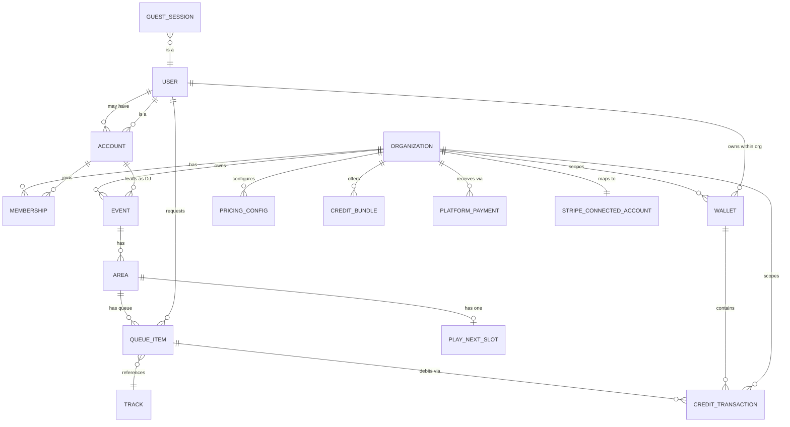

# mrdj — Architecture (v1 Multi-Tenant Marketplace)

> The contract artifact. This is the smallest coherent design that supports the shipped MVP slices while moving mrdj to multi-tenant marketplace operation.
> Owned by **Rusty**; implements decisions D1–D5, D7, and A1 from `.squad/decisions.md`.

---

## 1. Core Entities & Relationships

### 1.1 Entity-Relationship Diagram



### 1.2 Entity Definitions

#### **User** (abstract identity)
Every participant has a User identity — either a transient Guest session or a persistent Account.

| Field | Type | Notes |
|-------|------|-------|
| `id` | UUID | PK; **server-authoritative** |
| `type` | enum | `guest` \| `account` |
| `created_at` | timestamp | |

#### **GuestSession**
Lightweight, no-account identity. Tied to a browser session; sufficient for requests and credit spend within an Organization-scoped event.

| Field | Type | Notes |
|-------|------|-------|
| `id` | UUID | PK (same as User.id for type=guest) |
| `event_id` | UUID | FK → Event; scoped to one event |
| `session_token_hash` | text | Hashed token for session validation |
| `expires_at` | timestamp | Auto-expire after event or inactivity |

#### **Account**
Persistent identity (Google SSO). Account no longer implies tenant admin. Organization authority comes from Membership; Platform Admin is separate.

| Field | Type | Notes |
|-------|------|-------|
| `id` | UUID | PK (same as User.id for type=account) |
| `provider` | text | `google` (extensible) |
| `provider_id` | text | External ID from SSO |
| `email` | text | Unique |
| `display_name` | text | |
| `is_platform_admin` | bool | SaaS operator permission; distinct from org roles |
| `created_at` | timestamp | |

#### **Organization**
The tenant: a DJ business. A solo DJ is an Organization of one. Owns its Stripe Connect account, events, pricing, credit bundles, and member roster.

| Field | Type | Notes |
|-------|------|-------|
| `id` | UUID | PK |
| `slug` | text | Unique tenant slug for `/o/{slug}` routing |
| `name` | text | Display name |
| `stripe_connect_account_id` | text | Stripe connected account id; nullable until onboarding starts |
| `charges_enabled` | bool | Mirrored from Stripe; paid actions blocked until true |
| `payouts_enabled` | bool | Mirrored from Stripe; payout readiness |
| `created_at` | timestamp | |

#### **Membership**
User↔Organization link carrying org role. Replaces the global "admin = DJ" assumption from D3.

| Field | Type | Notes |
|-------|------|-------|
| `organization_id` | UUID | FK → Organization |
| `account_id` | UUID | FK → Account |
| `role` | enum | `owner` \| `manager` \| `dj` \| `staff` |
| `created_at` | timestamp | |

#### **Event**
A DJ session owned by exactly one Organization. Events may run concurrently within the same Organization and are assigned a lead DJ.

| Field | Type | Notes |
|-------|------|-------|
| `id` | UUID | PK |
| `organization_id` | UUID | FK → Organization; tenant isolation column |
| `slug` | text | URL-friendly event code; unique within Organization |
| `name` | text | Display name |
| `lead_dj_membership_id` | UUID | FK → Membership with role `dj`, `manager`, or `owner` |
| `status` | enum | `draft` \| `live` \| `ended`; **server-authoritative** |
| `created_at` | timestamp | |
| `started_at` | timestamp | When the DJ went live |
| `ended_at` | timestamp | |

#### **Area**
Optional subdivision of an Event: zone, room, stage, or dance floor. Every Event has at least one default Area.

| Field | Type | Notes |
|-------|------|-------|
| `id` | UUID | PK |
| `event_id` | UUID | FK → Event |
| `name` | text | Area display name |
| `is_default` | bool | Exactly one default Area per Event |
| `created_at` | timestamp | |

#### **Track** (normalized, provider-agnostic)
A song abstraction. Resolved from Apple Music or Spotify; stored/cached for display.

| Field | Type | Notes |
|-------|------|-------|
| `id` | UUID | PK; internal ID |
| `provider` | enum | `apple_music` \| `spotify` |
| `provider_id` | text | External ID from provider |
| `title` | text | |
| `artist` | text | |
| `album` | text | |
| `artwork_url` | text | |
| `duration_ms` | int | |
| `preview_url` | text | (optional) |
| `cached_at` | timestamp | For cache invalidation |

#### **QueueItem** (Request)
A song request in an Area queue. This extends A1's Event→Queue baseline: QueueItem moves from `event_id` to `area_id`.

| Field | Type | Notes |
|-------|------|-------|
| `id` | UUID | PK |
| `area_id` | UUID | FK → Area |
| `track_id` | UUID | FK → Track |
| `requester_id` | UUID | FK → User |
| `position` | int | **Server-authoritative**; 1 = next to play within Area |
| `status` | enum | `pending` \| `approved` \| `playing` \| `played` \| `rejected` |
| `is_play_next` | bool | True if this item holds the Area's Play Next slot |
| `created_at` | timestamp | |
| `updated_at` | timestamp | |

#### **PlayNextSlot** (single-resource lock per Area)
The crux state machine. One row per Area; models premium Play Next availability in that Area only.

| Field | Type | Notes |
|-------|------|-------|
| `area_id` | UUID | PK; FK → Area |
| `status` | enum | `available` \| `locked` \| `cooldown`; **server-authoritative** |
| `holder_queue_item_id` | UUID | FK → QueueItem; null when available |
| `locked_at` | timestamp | When purchased |
| `reset_at` | timestamp | When the bumped song finished playing |

#### **Wallet**
Credit balance for a User within one Organization. Credits are not portable across Organizations.

| Field | Type | Notes |
|-------|------|-------|
| `organization_id` | UUID | FK → Organization; tenant isolation column |
| `user_id` | UUID | FK → User; supports guest and account wallets |
| `balance` | int | Current credit balance; **server-authoritative** |
| `updated_at` | timestamp | |

#### **CreditTransaction** (append-only ledger)
Every credit grant and spend. Immutable, auditable, and Organization-scoped per D4/D7.

| Field | Type | Notes |
|-------|------|-------|
| `id` | UUID | PK |
| `organization_id` | UUID | FK → Organization; tenant isolation column |
| `user_id` | UUID | FK → User |
| `type` | enum | `grant` \| `spend` \| `refund` |
| `amount` | int | Positive = credit, negative = debit |
| `reason` | text | `purchase`, `up_next`, `play_next`, `refund`, `promo` |
| `reference_id` | UUID | FK to QueueItem or external payment ID |
| `idempotency_key` | text | Unique within Organization; prevents duplicate processing |
| `created_at` | timestamp | Immutable |

#### **PricingConfig** and **CreditBundle**
Per-Organization pricing and credit-pack configuration. Platform defaults seed new Organizations.

| Field | Type | Notes |
|-------|------|-------|
| `organization_id` | UUID | FK → Organization; tenant isolation column |
| `normal_request_cost` | int | May be zero, pending O2 |
| `up_next_cost` | int | Per-org override |
| `play_next_cost` | int | Per-org override |
| `bundle_amount` / `price_cents` | int | CreditBundle values |

#### **PlatformPayment** / transfer ledger concept
Design-level ledger for Stripe Connect money movement, separate from the credits ledger.

| Field | Type | Notes |
|-------|------|-------|
| `id` | UUID | PK |
| `organization_id` | UUID | FK → Organization |
| `stripe_payment_intent_id` | text | Provider reference |
| `stripe_charge_id` | text | Provider reference |
| `stripe_transfer_id` | text | Destination/separate charge transfer reference, if applicable |
| `gross_cents` | int | Guest paid amount |
| `platform_fee_cents` | int | Application fee retained by platform |
| `net_cents` | int | Amount destined to connected account |
| `status` | enum | `pending` \| `succeeded` \| `failed` \| `refunded` \| `disputed` |
| `idempotency_key` | text | Unique within Organization |
| `created_at` | timestamp | |

---

## 2. Tenant-Isolation Strategy

1. Every tenant-scoped table carries `organization_id`: Event, Wallet, CreditTransaction, PricingConfig, CreditBundle, PlatformPayment, and any future tenant-owned record. Area and QueueItem inherit tenant scope through Event → Area.
2. Every tenant-scoped query filters by `organization_id` or joins through a parent already filtered by `organization_id`.
3. Use one query seam for tenant scoping — a Drizzle-based scoped query helper (`forOrg(organizationId)`) that injects the `organization_id` filter (D8) — so handlers cannot casually bypass Organization filters.
4. MVP enforcement is app-level `organization_id` scoping per O13. PostgreSQL RLS is a later hardening option, not required for the first multi-tenant slice.
5. Tenant routing is path-based `/o/{slug}` for MVP per O12. Subdomains can be added later without changing the Organization model.
6. Platform Admin bypass is explicit and auditable; Platform Admin is not an Organization role.

---

## 3. The Play Next State Machine

Play Next is the premium, single-slot bump. The rules from D4/A1 remain, but the scope changes from Event to Area:

1. Only **ONE** Play Next is purchasable at any time per Area.
2. It is **not always available**.
3. After the Play-Next'd song **has played** in that Area, the slot **resets** to available.

Single-area events are just Events with one default Area. Large events use multiple Areas, each with its own queue and Play Next slot.

### 3.1 State Diagram

```mermaid
stateDiagram-v2
    [*] --> Available : Area opens

    Available --> Locked : Guest purchases Play Next in Area
    note right of Locked : holder_queue_item_id set; Area queue position = 1

    Locked --> Cooldown : DJ marks holder as "playing"
    note right of Cooldown : Song is now playing; Area slot not purchasable

    Cooldown --> Available : DJ marks holder as "played"
    note right of Available : holder_queue_item_id = null; Area slot purchasable again

    Locked --> Available : Refund/cancel (org staff action)
```



### 3.2 Transitions & Guards

| From | To | Trigger | Guard / Invariant |
|------|-----|---------|-------------------|
| `available` | `locked` | `purchase_play_next(area_id, queue_item_id, idempotency_key)` | Area slot status == `available`; queue item belongs to same Area; sufficient Organization-scoped credits; atomic credit debit + slot lock |
| `locked` | `cooldown` | `mark_now_playing(area_id, queue_item_id)` | Lead DJ / authorized Membership action; queue_item_id == holder_queue_item_id |
| `cooldown` | `available` | `mark_played(area_id, queue_item_id)` | Lead DJ / authorized Membership action; clears holder |
| `locked` | `available` | `cancel_play_next(area_id, queue_item_id)` | Authorized Membership action; refunds Organization-scoped credits |

### 3.3 Concurrency Hazard & Lock

**Problem:** Two guests race to purchase the same Area's Play Next slot simultaneously.

**Solution:** The slot is a **single-resource lock** implemented via:

1. **Database row-level lock**: `SELECT … FOR UPDATE` on the `PlayNextSlot` row keyed by `area_id`.
2. **Atomic transaction**: Check status == `available`, debit Organization-scoped credits, set status = `locked`, set `holder_queue_item_id` — all in one transaction.
3. **Idempotency key**: Unique per Organization + purchase attempt; retries are safe.

**Invariant:** At most one `QueueItem.is_play_next = true` per Area at any time.

---

## 4. Up Next vs Play Next

Both are paid queue bumps inside one Area. The difference:

| Aspect | Up Next | Play Next |
|--------|---------|-----------|
| **Effect** | Moves a request toward the front of its Area queue | Moves a request to **position 1** in its Area |
| **Availability** | Always available (any queued item) | **Single Area slot**; only when status == `available` |
| **Cost** | Lower | Higher (premium) |
| **Concurrency** | Multiple guests can bump different items simultaneously | Only one guest can hold a given Area slot at a time |
| **Reset** | N/A | Resets after the bumped song has played in that Area |

### 4.1 Up Next Implementation

1. Guest selects a queued item in an Area.
2. Backend validates: item exists, owned by requester, belongs to the active Organization, and the requester has sufficient Organization-scoped credits.
3. **Transaction:**
   - Debit credits through `CreditsService` with `organization_id` and idempotency key.
   - Reorder only that Area's queue.
4. Broadcast Area queue update via realtime channel.

### 4.2 Play Next Implementation

1. Guest selects a queued item in an Area.
2. Backend validates: Area PlayNextSlot.status == `available`, item exists, owned by requester, sufficient Organization-scoped credits.
3. **Transaction (single DB transaction):**
   - Acquire row lock on PlayNextSlot for `area_id`.
   - Double-check status == `available`.
   - Debit credits through `CreditsService` with `organization_id` and idempotency key.
   - Set PlayNextSlot: status = `locked`, holder_queue_item_id = item.id.
   - Set QueueItem: is_play_next = true, position = 1.
   - Shift other items in the same Area down.
4. Broadcast Area queue update + Play Next status via realtime channel.

---

## 5. Service / Module Layout

```
mrdj/
├── api/                         # Node.js Express API
│   ├── src/
│   │   ├── identity/            # Auth, sessions, Google SSO, Platform Admin flag
│   │   ├── organization/        # Organization CRUD, Memberships, org roles, Area management
│   │   ├── event/               # Event CRUD, lifecycle, lead DJ assignment
│   │   ├── queue/               # Area queues, ordering, Play Next state machine
│   │   ├── credits/             # Organization-scoped Wallet + CreditTransaction ledger (THE SEAM)
│   │   ├── payments/            # Guest checkout, payment intents, checkout stubs
│   │   ├── billing/             # Stripe Connect onboarding, application fees, transfers, webhooks
│   │   ├── music/               # Apple Music + Spotify, Track normalization
│   │   ├── realtime/            # WebSocket or SSE fan-out (O3)
│   │   ├── admin/               # DJ console APIs and Platform Admin surfaces
│   │   └── db/                  # Drizzle schema, client, scoped query seam (forOrg)
│   └── drizzle/                 # drizzle-kit migrations + snapshots (D8)
├── web/                         # React + Tailwind
├── k8s/                         # Kustomize manifests (or in cluster repo — O5)
└── docs/                        # This document, PRD, slice contracts
```

### 5.1 Module Boundaries

| Module | Responsibility | Owner |
|--------|----------------|-------|
| `identity` | Auth, guest sessions, account identity, Platform Admin flag | Basher |
| `organization` | Organization CRUD, Membership roster, org role checks, Area management | Rusty + Basher |
| `event` | Event CRUD, join codes, lifecycle, lead DJ assignment | Basher |
| `queue` | Area queue state machine, ordering, Play Next lock, position management | Basher |
| `credits` | Organization-scoped Wallet, CreditTransaction ledger, balance queries, transactional debits/grants | Frank (interface), Basher (integration) |
| `payments` | Guest checkout entry points and payment intent creation; calls billing/Connect for destination/application-fee details | Frank |
| `billing` | Stripe Connect Express onboarding, connected account status, application fees, payouts/transfers, provider webhooks | Frank |
| `music` | Provider abstraction, Track resolution, search, caching | Livingston |
| `realtime` | Live Area queue sync to guests/DJ (WebSocket or SSE — O3) | Basher |
| `admin` | DJ console APIs for authorized Memberships; separate Platform Admin views | Basher |

### 5.2 One Source of Truth

- **Tenant context**: Organization resolved once per request from `/o/{slug}` or trusted server context, then carried through the query seam.
- **Queue state**: PostgreSQL `QueueItem` table + `PlayNextSlot` table. The backend is authoritative.
- **Credit balance**: PostgreSQL `Wallet` scoped by Organization + User, derived from `CreditTransaction` ledger.
- **Play Next availability**: `PlayNextSlot.status` per Area — server-truth, never trust the client.
- **Money movement**: Stripe is provider truth; `PlatformPayment` records our idempotent marketplace ledger.

---

## 6. Money Paths: Marketplace, Server-Authoritative, Transactional, Idempotent

### 6.1 Credit Grant Flow (Stripe Connect Purchase)

```
Guest → Frontend /o/{orgSlug} → POST /api/payments/checkout
                                  ↓
                            Backend resolves Organization
                            Loads per-Organization bundle/pricing
                            Confirms charges_enabled
                                  ↓
                            Stripe checkout/payment intent
                            - platform is merchant of record for platform charge shape
                            - application fee retained by platform
                            - funds destined to Organization connected account
                                  ↓
Stripe webhook → Backend verifies signature
                                  ↓
                            Lookup organization_id + idempotency_key
                            If already processed → 200 OK, no-op
                            Else → Transaction:
                              - Insert PlatformPayment
                              - Insert CreditTransaction (type=grant, organization_id)
                              - Update Wallet.balance for organization_id + user_id
                            → 200 OK
```

**Invariants:**
- Credits are granted **only** after server-side webhook verification.
- The `idempotency_key` includes Organization context and prevents double-grant on webhook replay.
- Raw card data never touches our servers (hosted checkout / hosted fields).
- An Organization cannot accept paid actions until Stripe Connect says `charges_enabled` and required onboarding is complete; payout UX also tracks `payouts_enabled`.
- Stripe Connect account type is O10; current recommendation is Express.

### 6.2 Credit Spend Flow (Up Next / Play Next)

```
Guest → Frontend → POST /api/areas/{areaId}/queue/{id}/bump (or /play-next)
                          ↓
                    Backend validates:
                      - Area belongs to Organization
                      - User owns the queue item
                      - Sufficient Organization-scoped credits
                      - (Play Next only) Area slot is available
                          ↓
                    Transaction (single DB tx):
                      - Acquire lock (Play Next: row lock on PlayNextSlot area_id)
                      - Insert CreditTransaction (type=spend, organization_id, idempotency_key)
                      - Update Wallet.balance (organization_id + user_id debit)
                      - Update Area queue positions / PlayNextSlot
                          ↓
                    Commit → Broadcast realtime update for that Area
```

**Invariants:**
- **Transactional**: Credit debit + queue/slot update in one atomic transaction. If either fails, both roll back.
- **Idempotent**: Client sends an `idempotency_key` with each spend request; uniqueness is Organization-scoped.
- **No double-charge**: The transaction either succeeds fully or not at all.
- **No cross-tenant credits**: Credits purchased for Organization A cannot be spent at Organization B.

### 6.3 The Credits-Ledger Contract Seam

This is still the named boundary that **Frank (payments/billing)** and **Basher (queue)** both depend on, extended for Organization scope:

```
┌────────────────────────────────────────────────────────────────────────────┐
│                         CREDITS-LEDGER CONTRACT                            │
│                                                                            │
│  Interface: CreditsService                                                 │
│                                                                            │
│  Methods:                                                                  │
│    grantCredits(organizationId, userId, amount, reason, idempotencyKey)    │
│      → { success: bool, newBalance: int, transactionId: UUID }             │
│                                                                            │
│    spendCredits(organizationId, userId, amount, reason, referenceId, key)  │
│      → { success: bool, newBalance: int, transactionId: UUID }             │
│      (returns success=false if insufficient Organization balance)           │
│                                                                            │
│    refundCredits(organizationId, userId, amount, reason, originalTxId,key) │
│      → { success: bool, newBalance: int, transactionId: UUID }             │
│                                                                            │
│    getBalance(organizationId, userId)                                      │
│      → { balance: int }                                                    │
│                                                                            │
│  Guarantees:                                                               │
│    - All mutations are transactional (DB tx boundary)                      │
│    - Idempotency: same Organization + idempotencyKey → same result         │
│    - Append-only ledger: CreditTransaction is immutable                    │
│    - Balance is always scoped to Organization + User                       │
│                                                                            │
│  Consumers:                                                                │
│    - payments/billing modules (grantCredits after webhook)                 │
│    - queue module (spendCredits for Up Next / Play Next)                   │
│    - admin module (refundCredits for cancellations)                        │
└────────────────────────────────────────────────────────────────────────────┘
```

This remains the **seam**. Frank's webhook handler calls `grantCredits`. Basher's queue handlers call `spendCredits`. Neither reaches into the other's implementation.

---

## 7. Realtime Sync Shape

### 7.1 Data Shape

The live queue and Play Next status must propagate to:
- **Guests**: see the Area queue update when others request/bump.
- **DJ Console**: see one or more active Area queues in real time, manage playback.

**Payload shape (Area queue update):**
```json
{
  "type": "queue_update",
  "organization_id": "uuid",
  "event_id": "uuid",
  "area_id": "uuid",
  "queue": [
    { "id": "uuid", "track": { "title": "...", "artist": "...", "artwork_url": "..." }, "position": 1, "is_play_next": true },
    { "id": "uuid", "track": { "title": "..." }, "position": 2, "is_play_next": false }
  ],
  "play_next_status": "locked"
}
```

**Traffic pattern:**
- **Server → Client (fan-out)**: Area queue updates, Play Next status changes. High frequency during active events.
- **Client → Server**: Guest actions are **plain HTTP POST** — no need for bidirectional realtime.

### 7.2 Open Decision O3: WebSocket vs SSE

**This decision is owned by Basher.** The architecture supports either. SSE remains the simplest fit for mostly server→client fan-out, but multi-Area DJ consoles may affect Basher's final call.

---

## 8. Migration Strategy (Design-Level Only)

No migration is written in this architecture pass. Per **D8** the data layer moves to **Drizzle ORM + `drizzle-kit`**; every step below is authored as a Drizzle schema change with a `drizzle-kit` generated SQL migration (replacing node-pg-migrate / raw `pgm.sql`). The forward path:

0. **Adopt Drizzle over the current single-tenant schema first** (prerequisite epic, before any tenant changes): introspect the existing tables into a Drizzle schema, route the existing raw-`pg` queries through the Drizzle client incrementally (table-by-table), and keep the shipped slice-01/02 money-path tests green — including `SELECT … FOR UPDATE` via Drizzle's `.for('update')`.
1. Introduce Organization and Membership tables.
2. Backfill one default Organization for existing single-tenant data.
3. Create Memberships for existing admin/DJ accounts; map prior `accounts.role = admin` intent into Organization roles (`owner` / `manager` / `dj`) instead of global tenant authority.
4. Add `organization_id` to Event, Wallet, CreditTransaction, PricingConfig, CreditBundle, and PlatformPayment tables.
5. Scope existing wallets, credits, pricing config, and credit bundles to the default Organization.
6. Create one default Area per existing Event.
7. Move `queue_items.event_id` to `queue_items.area_id` through each Event's default Area.
8. Move `play_next_slot.event_id` PK to `play_next_slot.area_id` PK through each Event's default Area.
9. Preserve shipped slice-01/slice-02 behavior with default Organization/default Area resolution so existing endpoints continue to work while new `/o/{slug}` APIs are introduced.
10. Add Stripe Connect fields on Organization, then backfill connected account data only when onboarding occurs.

---

## 9. Open Questions Surfaced

### O2 — Normal Request Cost (Free vs Low-Cost)
The architecture supports both. If free: no credit debit on request. If low-cost: add a `spendCredits` call in the request flow. The credits-ledger contract handles either.

### O3 — Realtime Transport
Architecture remains compatible with SSE or WebSocket. Multi-Area console views increase fan-out count but not bidirectionality by themselves.

### O6 — Music Provider MVP Scope
The `Track` abstraction and `music` module are provider-agnostic by design.

### O8–O16 — Multi-Tenant Marketplace Follow-ups
The multi-tenant architecture assumes the current recommendations: Organization-scoped credits, per-Organization pricing with platform defaults, Stripe Connect Express, percentage application fee, path-based routing, app-level tenant scoping, hosted KYC, default Organization/default Area migration, and deferring optional DJ subscription tiers.

---

## 10. Summary

| Concept | Design |
|---------|--------|
| **Tenant** | Organization = DJ business; solo DJ is Organization of one |
| **Roles** | Membership org roles (`owner`, `manager`, `dj`, `staff`); Platform Admin separate |
| **Credits** | Append-only ledger scoped by Organization + User; credits do not cross Organizations |
| **Pricing** | PricingConfig and CreditBundle are per-Organization, seeded from platform defaults |
| **Queue** | One authoritative queue per Area; every Event has at least one default Area |
| **Play Next** | Single-slot lock per Area; `available` → `locked` → `cooldown` → `available` reset after song plays |
| **Concurrency** | Row-level lock + atomic transaction prevents double-sell of an Area's Play Next slot |
| **Money paths** | Marketplace via Stripe Connect; platform fee retained, DJ tenant paid out through connected account |
| **Tenant isolation** | App-level `organization_id` scoping through one query seam for MVP; RLS later |
| **Modules** | identity, organization, event, queue, credits, payments, billing, music, realtime, admin |
| **Data layer** | Drizzle ORM + `drizzle-kit` migrations (replaces raw `pg` + node-pg-migrate); typed schema + scoped `forOrg` query seam; `.for('update')` keeps money-path row locks first-class (D8) |

---

*Document version: v1 (multi-tenant marketplace). Authored by Rusty, 2026-06-24T09:17:13-04:00.*
